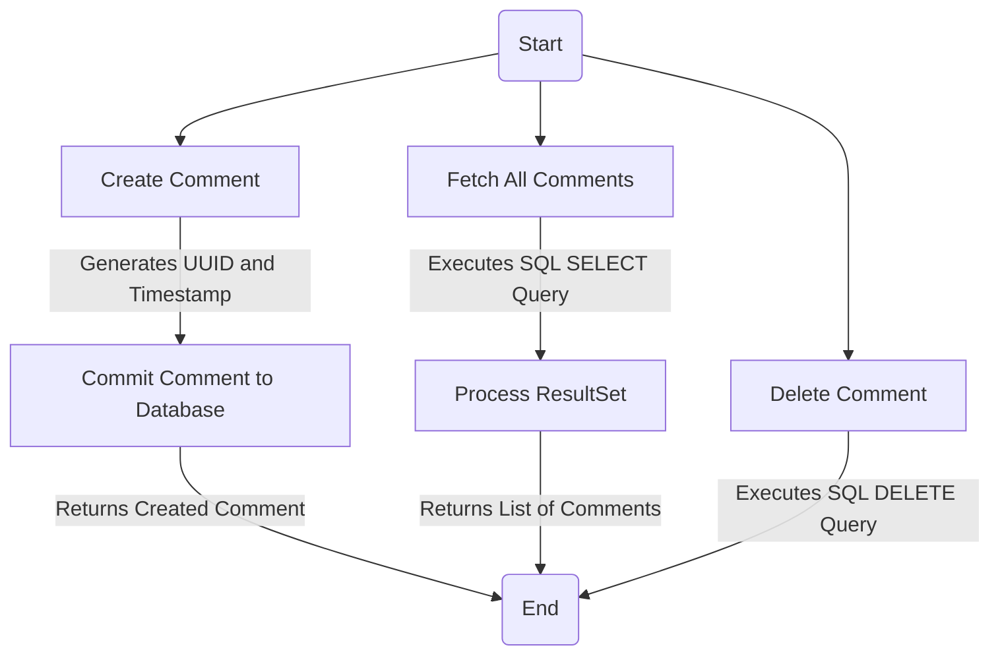
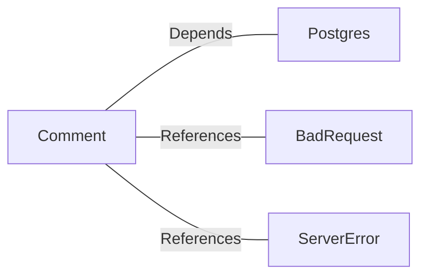

# Comment.java: Comment Management System

## Overview
The `Comment` class is responsible for managing comments in a system. It provides functionality to create, fetch, and delete comments, as well as commit them to a database. The class interacts with a PostgreSQL database to store and retrieve comment data.

## Process Flow

## Insights
- **Comment Creation**:
  - Generates a unique identifier (`UUID`) and timestamp for each comment.
  - Commits the comment to the database using an `INSERT` SQL query.
  - Throws custom exceptions (`BadRequest`, `ServerError`) for error handling.

- **Fetching All Comments**:
  - Executes a `SELECT` SQL query to retrieve all comments from the database.
  - Processes the result set to create a list of `Comment` objects.

- **Comment Deletion**:
  - Deletes a comment by its `id` using a `DELETE` SQL query.
  - Returns `true` if the deletion is successful, otherwise `false`.

- **Database Interaction**:
  - Uses `Postgres.connection()` to establish a connection to the database.
  - Employs `PreparedStatement` for parameterized queries to prevent SQL injection.

## Dependencies

- `Postgres`: Provides the database connection for executing SQL queries.
- `BadRequest`: Custom exception thrown when a comment cannot be saved.
- `ServerError`: Custom exception thrown for server-related errors.

## Data Manipulation (SQL)
### Table Structure: `comments`
| Attribute   | Data Type   | Description                          |
|-------------|-------------|--------------------------------------|
| `id`        | `VARCHAR`   | Unique identifier for the comment.  |
| `username`  | `VARCHAR`   | Username of the comment author.     |
| `body`      | `TEXT`      | Content of the comment.             |
| `created_on`| `TIMESTAMP` | Timestamp when the comment was created. |

### SQL Operations
- **INSERT**: Adds a new comment to the `comments` table.
- **SELECT**: Retrieves all comments from the `comments` table.
- **DELETE**: Removes a comment from the `comments` table by its `id`.

## Vulnerabilities
1. **SQL Injection in `fetch_all`**:
   - The `fetch_all` method uses a raw SQL query (`stmt.executeQuery(query)`), which is vulnerable to SQL injection. It should use `PreparedStatement` for parameterized queries.

2. **Improper Exception Handling in `delete`**:
   - The `delete` method always returns `false` in the `finally` block, even if the deletion is successful. This can lead to incorrect behavior.

3. **Resource Management**:
   - Database connections (`Connection`) and statements (`Statement`, `PreparedStatement`) are not properly closed in all methods, which can lead to resource leaks.

4. **Error Logging**:
   - Exceptions are printed to `System.err` without proper logging mechanisms, which is not ideal for production environments.

5. **Hardcoded SQL Queries**:
   - SQL queries are hardcoded, making them difficult to maintain and prone to errors. Using a query builder or ORM could improve maintainability.
