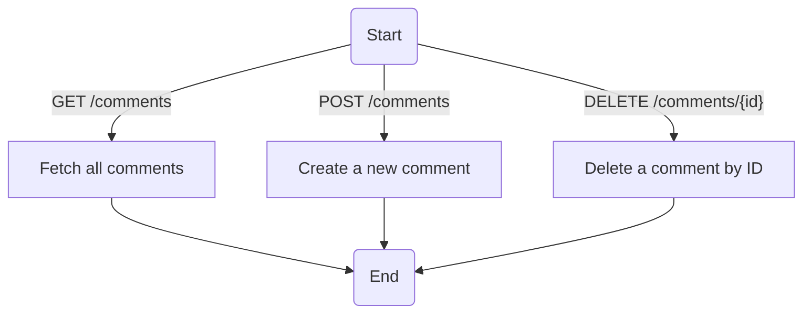
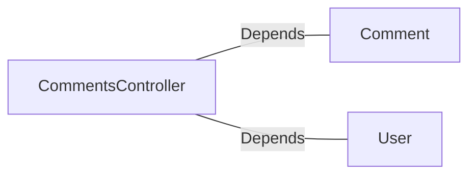

# CommentsController.java: REST API for Comment Management

## Overview
This file defines a REST API controller for managing comments. It provides endpoints to fetch all comments, create a new comment, and delete an existing comment. The controller uses Spring Boot annotations for configuration and routing, and includes basic authentication via a custom token mechanism.

## Process Flow

## Insights
- **Authentication**: The controller uses a custom authentication mechanism (`User.assertAuth`) to validate requests based on a secret and token.
- **Cross-Origin Resource Sharing (CORS)**: All endpoints allow requests from any origin (`@CrossOrigin(origins = "*")`), which may pose security risks.
- **Error Handling**: Custom exceptions (`BadRequest` and `ServerError`) are defined to handle specific error scenarios with appropriate HTTP status codes.
- **Serialization**: The `CommentRequest` class implements `Serializable` for handling request payloads.
- **Endpoints**:
  - `GET /comments`: Fetches all comments.
  - `POST /comments`: Creates a new comment.
  - `DELETE /comments/{id}`: Deletes a comment by ID.

## Dependencies

- `Comment`: Handles operations related to comments, such as fetching, creating, and deleting.
- `User`: Provides authentication functionality (`assertAuth`).

## Vulnerabilities
1. **CORS Misconfiguration**:
   - Allowing requests from all origins (`@CrossOrigin(origins = "*")`) can expose the API to Cross-Site Request Forgery (CSRF) attacks.
   - Recommendation: Restrict origins to trusted domains.

2. **Authentication Bypass**:
   - The `User.assertAuth` method is used for authentication, but its implementation is not provided. If improperly implemented, it could lead to authentication bypass.
   - Recommendation: Ensure robust token validation and consider using industry-standard authentication mechanisms like OAuth2.

3. **Hardcoded Secret**:
   - The `secret` value is injected from application properties (`@Value("${app.secret}")`). If not securely stored, it could be exposed.
   - Recommendation: Use a secure vault or environment variables to store sensitive secrets.

4. **Error Handling**:
   - The custom exceptions (`BadRequest` and `ServerError`) do not log the errors, which could make debugging difficult.
   - Recommendation: Implement proper logging for exceptions.

5. **Input Validation**:
   - The `CommentRequest` class does not validate its fields (`username` and `body`), which could lead to injection attacks or invalid data.
   - Recommendation: Add validation annotations (e.g., `@NotNull`, `@Size`) to ensure data integrity.

## Data Manipulation (SQL)
- **Comment**: Likely interacts with a database to perform operations such as fetching, creating, and deleting comments. However, the actual SQL operations are not visible in this code snippet.
