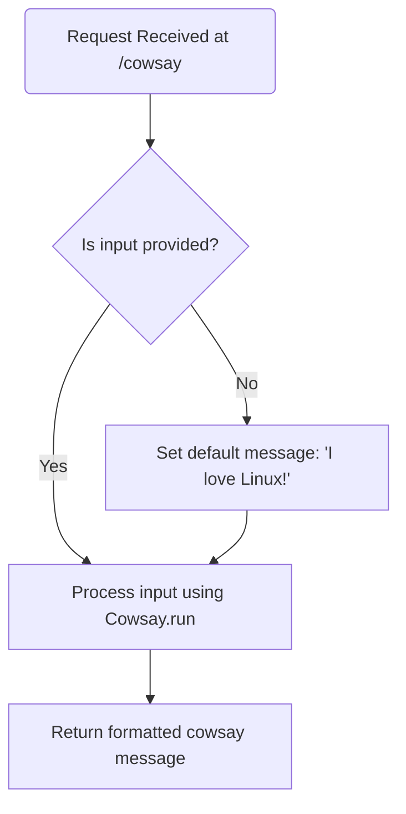
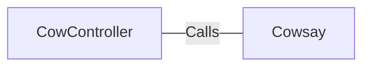

# CowController.java: REST Controller for CowSay Functionality

## Overview
The `CowController` class is a REST controller that provides an endpoint for generating "cowsay" messages. It uses the `Cowsay.run` method to process user input and return a formatted string. The default message is "I love Linux!" if no input is provided.

## Process Flow

## Insights
- The `CowController` class is annotated with `@RestController` and `@EnableAutoConfiguration`, making it a Spring Boot REST controller with auto-configuration enabled.
- The `/cowsay` endpoint accepts a query parameter `input` and passes it to the `Cowsay.run` method for processing.
- If no input is provided, the default message "I love Linux!" is used.
- The `Cowsay.run` method is assumed to handle the logic for generating the "cowsay" message.

## Dependencies

- `Cowsay`: Processes the input string and generates the "cowsay" message.

## Vulnerabilities
- **Potential Command Injection**: If the `Cowsay.run` method executes the input string without proper sanitization, it may be vulnerable to command injection attacks. Ensure that the input is validated and sanitized before processing.
- **Input Validation**: The `@RequestParam` annotation allows user input directly. If `Cowsay.run` does not handle malicious input properly, it could lead to unexpected behavior or security issues.
- **Default Message Exposure**: The default message "I love Linux!" is hardcoded, which may not be suitable for all use cases. Consider externalizing this configuration for better flexibility.
