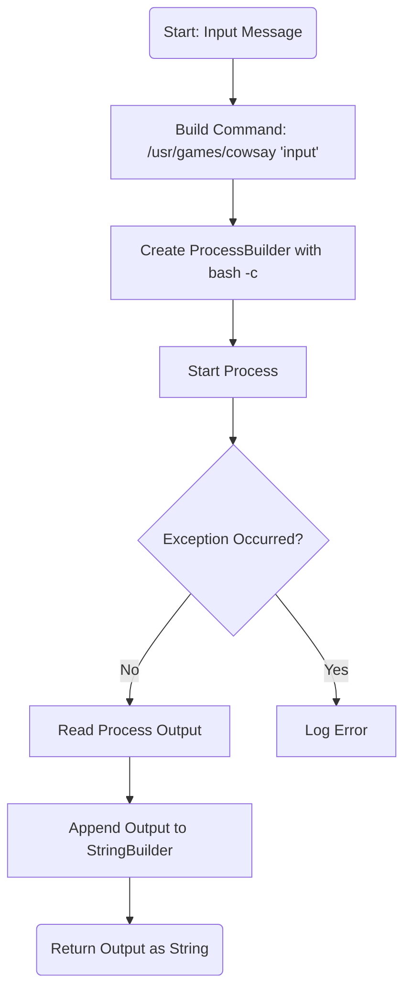
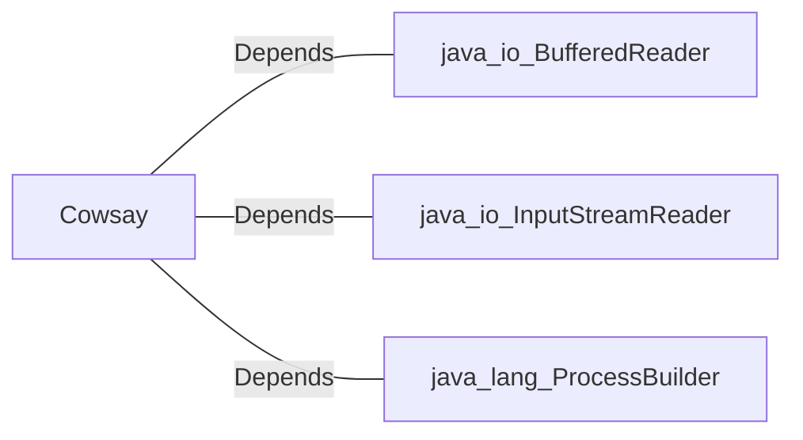

# Cowsay.java: Command Execution Wrapper for Cowsay

## Overview
The `Cowsay` class provides functionality to execute the `cowsay` command-line tool, which generates ASCII art of a cow saying a given input message. It uses Java's `ProcessBuilder` to execute the command and captures the output.

## Process Flow

## Insights
- The class uses `ProcessBuilder` to execute shell commands, which can be risky if the input is not properly sanitized.
- The `cmd` string concatenates user input directly, making it vulnerable to command injection attacks.
- The method captures the output of the `cowsay` command and returns it as a string.
- Error handling is present but limited to printing the stack trace, which may not be ideal for production environments.

## Vulnerabilities
1. **Command Injection**:
   - The `cmd` string directly concatenates user input without sanitization, allowing malicious users to inject arbitrary commands.
   - Example: If `input` is `"hello'; rm -rf /"`, the resulting command would be `/usr/games/cowsay 'hello'; rm -rf /`, which could delete files on the server.

2. **Error Handling**:
   - The error handling mechanism only prints the stack trace, which may expose sensitive information in logs and does not provide robust recovery mechanisms.

## Dependencies

- `java_io_BufferedReader`: Used to read the output of the executed process.
- `java_io_InputStreamReader`: Wraps the input stream of the process for reading.
- `java_lang_ProcessBuilder`: Used to create and manage the execution of the external command.

## Recommendations
- **Input Sanitization**:
  - Validate and sanitize the `input` parameter to prevent command injection.
  - Use libraries or APIs that safely handle external command execution.
  
- **Error Handling**:
  - Implement better error handling mechanisms, such as logging to a secure location or returning meaningful error messages to the caller.

- **Security Enhancements**:
  - Avoid using shell commands directly. If possible, use Java libraries or APIs to achieve the same functionality without invoking external processes.
