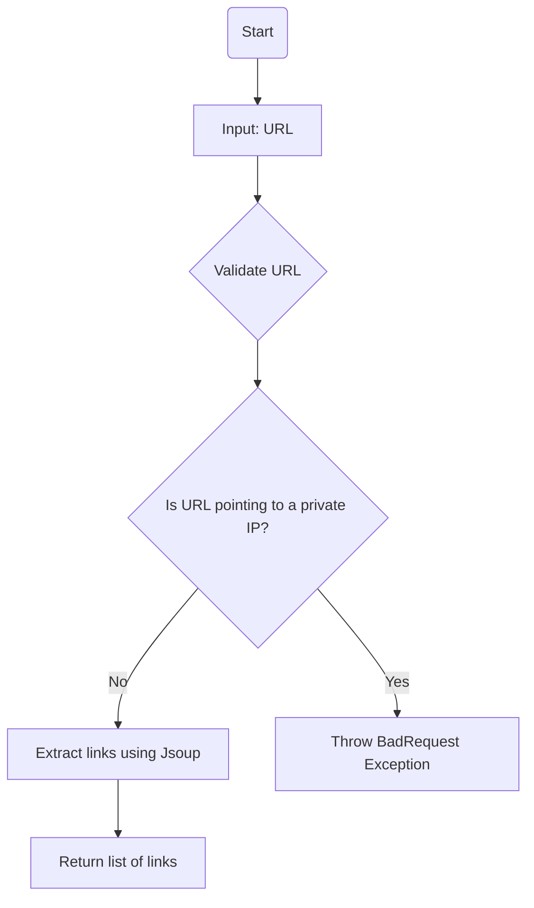
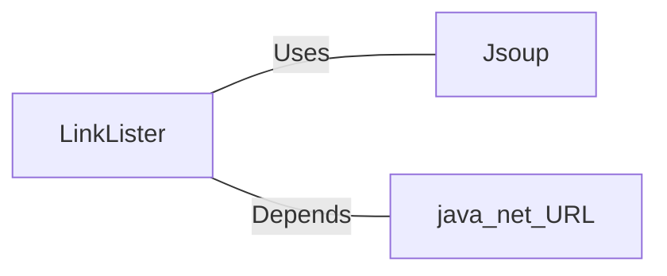

# LinkLister.java: Web Link Extractor

## Overview
The `LinkLister` class is responsible for extracting hyperlinks from a given webpage URL. It provides two methods for retrieving links:
1. `getLinks`: Extracts all hyperlinks from the provided URL.
2. `getLinksV2`: Adds validation to ensure the URL does not point to a private IP address before extracting links.

## Process Flow

## Insights
- **HTML Parsing**: The class uses the `Jsoup` library to parse HTML and extract links.
- **Private IP Validation**: The `getLinksV2` method ensures that the URL does not point to private IP ranges (`172.*`, `192.168.*`, `10.*`) to prevent potential misuse or security risks.
- **Error Handling**: The `getLinksV2` method wraps exceptions in a custom `BadRequest` exception for better error reporting.
- **URL Validation**: The `getLinksV2` method uses the `java.net.URL` class to validate and extract the host from the provided URL.

## Vulnerabilities
1. **Unvalidated Input in `getLinks`**:
   - The `getLinks` method directly connects to the provided URL without validating its format or ensuring it is safe. This could lead to SSRF (Server-Side Request Forgery) attacks if the input URL is malicious.
   - Recommendation: Add validation to ensure the URL is safe and does not point to internal or restricted resources.

2. **Private IP Check in `getLinksV2`**:
   - The private IP check only covers specific ranges (`172.*`, `192.168.*`, `10.*`). It does not account for other private or reserved IP ranges (e.g., `127.0.0.1`, `localhost`, or other non-routable addresses).
   - Recommendation: Expand the validation to include all private and reserved IP ranges.

3. **Error Handling in `getLinksV2`**:
   - The `getLinksV2` method catches all exceptions and wraps them in a `BadRequest` exception. This could lead to exposing internal error messages to the caller, which might reveal sensitive information.
   - Recommendation: Log the exception internally and return a generic error message to the caller.

4. **Potential Denial of Service**:
   - The `Jsoup.connect(url).get()` call in both methods could be exploited to perform a denial-of-service attack by providing URLs that take a long time to respond or consume excessive resources.
   - Recommendation: Set a connection timeout and limit the size of the response.

## Dependencies

- `Jsoup`: Used for parsing HTML and extracting links.
- `java.net.URL`: Used for validating and extracting the host from the provided URL.

## Data Manipulation (SQL)
No SQL data manipulation detected in the code.
