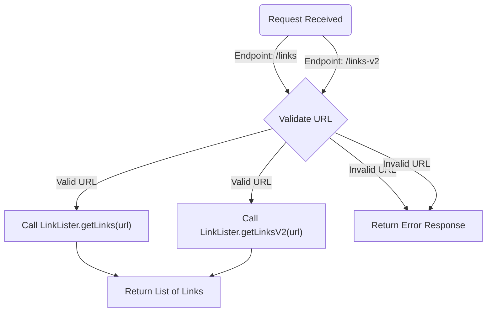
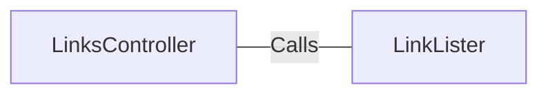

# LinksController.java: REST API for Extracting Links

## Overview
The `LinksController` class is a REST API controller that provides endpoints for extracting links from a given URL. It uses the `LinkLister` utility to process the URL and return a list of links. The class is built using Spring Boot and includes two endpoints: `/links` and `/links-v2`.

## Process Flow

## Insights
- The class defines two endpoints:
  - `/links`: Extracts links using `LinkLister.getLinks(url)`.
  - `/links-v2`: Extracts links using `LinkLister.getLinksV2(url)`.
- Both endpoints expect a `url` parameter as input.
- The `/links-v2` endpoint throws a custom `BadRequest` exception for invalid inputs.
- The `LinkLister` utility is responsible for the actual link extraction logic.
- The class uses Spring Boot annotations for REST API functionality:
  - `@RestController`: Marks the class as a REST controller.
  - `@EnableAutoConfiguration`: Enables Spring Boot's auto-configuration.
  - `@RequestMapping`: Maps HTTP requests to handler methods.

## Dependencies

- `LinkLister`: Provides methods `getLinks(url)` and `getLinksV2(url)` for extracting links from a URL.

## Vulnerabilities
- **Potential URL Injection**: The `url` parameter is directly passed to the `LinkLister` methods without validation or sanitization. This could lead to security issues such as SSRF (Server-Side Request Forgery) if the `LinkLister` implementation interacts with external URLs.
- **Error Handling**: The `/links` endpoint does not handle invalid URLs explicitly, which may result in unhandled exceptions.
- **BadRequest Exception**: The `/links-v2` endpoint uses a custom `BadRequest` exception, but its implementation is not shown. If not properly defined, it could lead to inconsistent error handling.
- **IOException Handling**: The `/links` endpoint declares `throws IOException`, but the handling of this exception is not shown, which could result in unclear error responses to the client.

## Recommendations
- Validate and sanitize the `url` parameter to prevent SSRF and other injection attacks.
- Implement proper error handling for both endpoints to ensure consistent and secure responses.
- Ensure the `BadRequest` exception is well-defined and used consistently.
- Log errors and exceptions for better debugging and monitoring.
