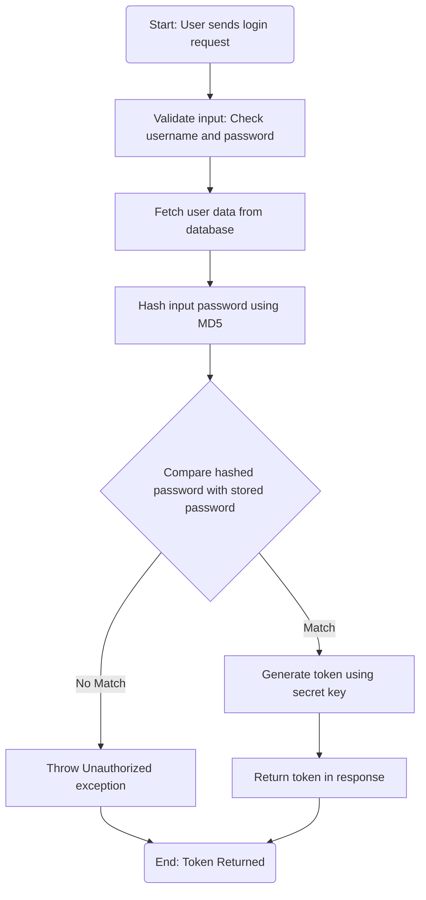
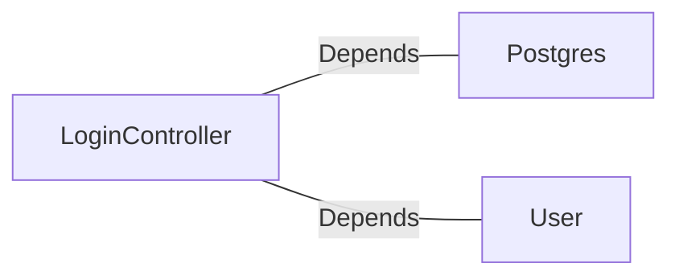

# LoginController.java: Login Authentication Controller

## Overview
The `LoginController` class is a REST API controller responsible for handling user login requests. It validates user credentials against stored data and generates a token for successful authentication. The controller uses Spring Boot annotations and integrates with external dependencies for user data fetching and password hashing.

## Process Flow

## Insights
- The `@CrossOrigin` annotation allows requests from any origin, which may pose security risks if not properly configured.
- Passwords are hashed using MD5, which is considered insecure for cryptographic purposes due to vulnerabilities like collision attacks.
- The `secret` key is injected using `@Value`, which should be securely managed to prevent exposure.
- The `Unauthorized` exception is thrown when authentication fails, returning a 401 HTTP status code.
- The `LoginRequest` and `LoginResponse` classes are simple data structures for handling input and output of the login process.

## Dependencies

- `Postgres`: Used for hashing the input password using MD5.
- `User`: Fetches user data from the database, including the hashed password and token generation.

### List of Identified External References
- `Postgres`: Provides the `md5` method for hashing passwords. Nature: Depends.
- `User`: Provides the `fetch` method to retrieve user data and the `token` method to generate authentication tokens. Nature: Depends.

## Vulnerabilities
1. **Insecure Password Hashing**:
   - MD5 is used for hashing passwords, which is outdated and vulnerable to collision attacks. Consider using a stronger hashing algorithm like bcrypt or Argon2.

2. **Cross-Origin Resource Sharing (CORS) Misconfiguration**:
   - The `@CrossOrigin(origins = "*")` annotation allows requests from any origin, which can expose the application to Cross-Site Request Forgery (CSRF) attacks. Restrict origins to trusted domains.

3. **Hardcoded Secret Key**:
   - The `secret` key is injected from application properties but must be securely managed to prevent exposure. Use environment variables or a secure vault for sensitive data.

4. **Potential User Enumeration**:
   - The application fetches user data based on the provided username. If the username does not exist, the behavior may inadvertently reveal valid usernames, enabling enumeration attacks.

5. **Lack of Rate Limiting**:
   - No rate limiting is implemented, which could make the login endpoint susceptible to brute force attacks.

6. **Exception Handling**:
   - The `Unauthorized` exception does not provide detailed logging or tracking, which may hinder debugging and monitoring of failed login attempts.
