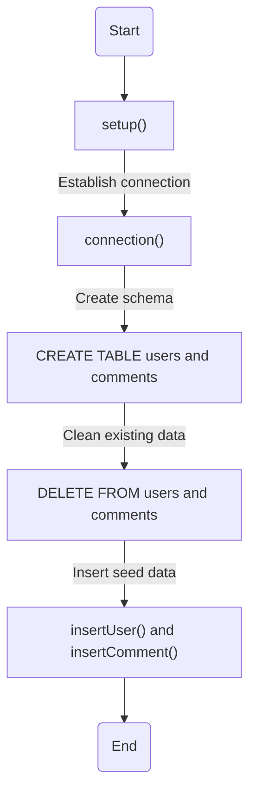
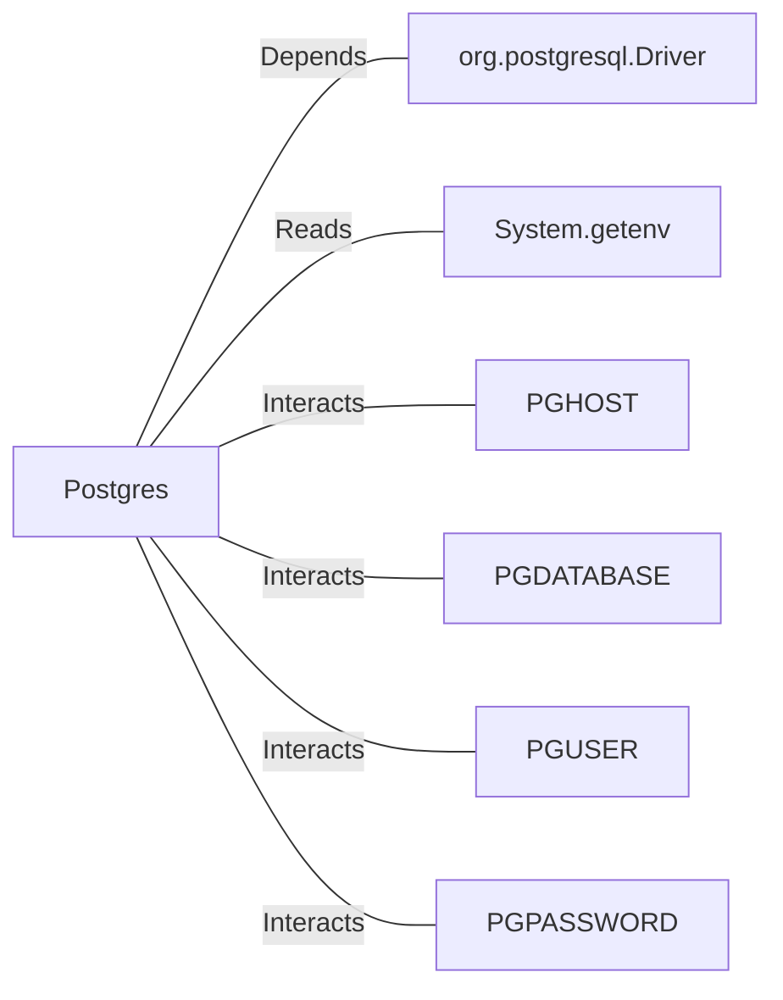

# Postgres.java: Database Setup and Interaction Utility

## Overview
The `Postgres` class is a utility for managing a PostgreSQL database. It provides methods to establish a connection, set up the database schema, insert seed data, and perform basic operations such as inserting users and comments. Additionally, it includes a method to generate MD5 hashes for password storage.

## Process Flow

## Insights
- **Database Connection**: The `connection()` method dynamically builds the connection string using environment variables (`PGHOST`, `PGDATABASE`, `PGUSER`, `PGPASSWORD`).
- **Schema Setup**: The `setup()` method creates two tables (`users` and `comments`) and ensures they exist before inserting seed data.
- **Password Hashing**: The `md5()` method hashes passwords using the MD5 algorithm before storing them in the database.
- **Seed Data**: The `setup()` method inserts predefined users and comments for initial database population.
- **UUID Usage**: Both `insertUser()` and `insertComment()` use UUIDs as primary keys for unique identification.
- **Error Handling**: Exceptions are caught and printed, but the program exits on critical errors during setup.

## Dependencies

- `org.postgresql.Driver`: Required for establishing a connection to the PostgreSQL database.
- `System.getenv`: Reads environment variables for database connection details.
- `PGHOST`, `PGDATABASE`, `PGUSER`, `PGPASSWORD`: Environment variables used to configure the database connection.

## Data Manipulation (SQL)
### Table Structures
#### `users`
| Attribute   | Type          | Description                                      |
|-------------|---------------|--------------------------------------------------|
| `user_id`   | `VARCHAR(36)` | Primary key, unique identifier for the user.     |
| `username`  | `VARCHAR(50)` | Unique username for the user.                    |
| `password`  | `VARCHAR(50)` | MD5 hashed password.                             |
| `created_on`| `TIMESTAMP`   | Timestamp of user creation.                      |
| `last_login`| `TIMESTAMP`   | Timestamp of the last login.                    |

#### `comments`
| Attribute   | Type          | Description                                      |
|-------------|---------------|--------------------------------------------------|
| `id`        | `VARCHAR(36)` | Primary key, unique identifier for the comment.  |
| `username`  | `VARCHAR(36)` | Username of the comment author.                  |
| `body`      | `VARCHAR(500)`| Content of the comment.                          |
| `created_on`| `TIMESTAMP`   | Timestamp of comment creation.                   |

### SQL Operations
- `CREATE TABLE`: Creates the `users` and `comments` tables if they do not exist.
- `DELETE FROM`: Clears existing data from the `users` and `comments` tables.
- `INSERT INTO`: Inserts seed data into the `users` and `comments` tables.

## Vulnerabilities
1. **MD5 for Password Hashing**:
   - MD5 is considered cryptographically insecure and vulnerable to collision attacks. It is not recommended for password hashing.
   - Recommendation: Use a stronger hashing algorithm like bcrypt or Argon2.

2. **Hardcoded Seed Data**:
   - The seed data includes hardcoded passwords, which could be a security risk if exposed.
   - Recommendation: Avoid hardcoding sensitive data and use environment variables or secure storage.

3. **Error Handling**:
   - Exceptions are printed to the console, potentially exposing sensitive information.
   - Recommendation: Log errors securely and avoid printing stack traces in production.

4. **Environment Variable Dependency**:
   - The program relies on environment variables for database connection details, which could lead to misconfiguration or exposure.
   - Recommendation: Validate environment variables and consider using a secure configuration management system.

5. **SQL Injection Risk**:
   - While `PreparedStatement` is used, ensure all inputs are sanitized to prevent SQL injection attacks.
   - Recommendation: Validate and sanitize user inputs rigorously.
