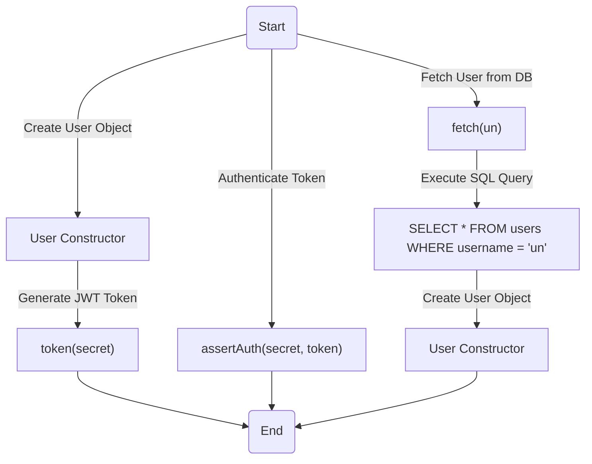
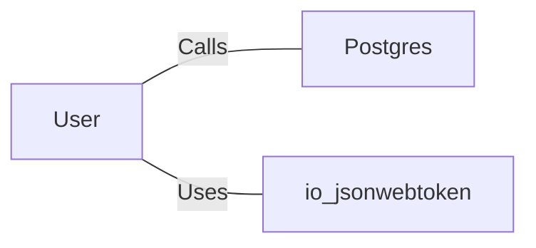

# User.java: User Management and Authentication

## Overview
The `User` class is responsible for managing user-related data and operations, including token generation, authentication, and fetching user details from a database. It provides methods for creating JWT tokens, validating them, and retrieving user information from a PostgreSQL database.

## Process Flow

## Insights
- **Token Generation**: The `token` method generates a JWT token using the user's username and a secret key. It uses the `io.jsonwebtoken` library for token creation.
- **Authentication**: The `assertAuth` method validates a JWT token using the provided secret key. If validation fails, it throws an `Unauthorized` exception.
- **Database Interaction**: The `fetch` method retrieves user details from a PostgreSQL database using a raw SQL query. It constructs a `User` object from the retrieved data.
- **Potential Vulnerabilities**:
  - **SQL Injection**: The `fetch` method directly concatenates user input (`un`) into the SQL query, making it vulnerable to SQL injection attacks.
  - **Hardcoded Secret Key**: The `token` and `assertAuth` methods rely on a secret key passed as a string, which could lead to security issues if the key is not securely managed.
  - **Error Handling**: Exceptions in the `fetch` method are printed to the console but not properly logged or handled, which could lead to information leakage.

## Dependencies

- `Postgres`: Provides the `connection()` method to establish a connection to the PostgreSQL database.
- `io.jsonwebtoken`: Used for creating and parsing JWT tokens.

## Data Manipulation (SQL)
### Table: `users`
| Attribute   | Type     | Description                          |
|-------------|----------|--------------------------------------|
| `user_id`   | String   | Unique identifier for the user.      |
| `username`  | String   | Username of the user.                |
| `password`  | String   | Hashed password of the user.         |

### SQL Command
- **Query**: `SELECT * FROM users WHERE username = 'un' LIMIT 1`
  - Retrieves user details based on the provided username.

## Vulnerabilities
1. **SQL Injection**:
   - The `fetch` method constructs SQL queries by directly concatenating user input (`un`), which can be exploited by attackers to execute arbitrary SQL commands.
   - **Mitigation**: Use prepared statements or parameterized queries to prevent SQL injection.

2. **Weak Secret Key Management**:
   - The `token` and `assertAuth` methods depend on a secret key passed as a string. If the key is hardcoded or improperly managed, it could be exposed and compromise security.
   - **Mitigation**: Store the secret key securely using environment variables or a secrets management tool.

3. **Error Handling**:
   - The `fetch` method prints exceptions to the console, which could expose sensitive information to attackers.
   - **Mitigation**: Implement proper logging mechanisms and avoid exposing stack traces in production environments.
