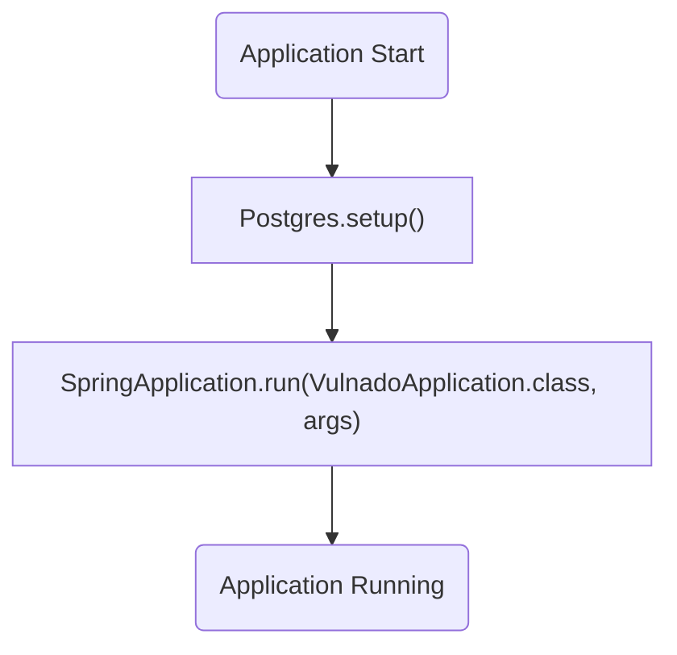
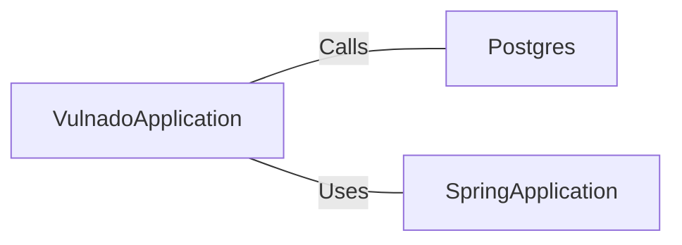

# VulnadoApplication.java: Spring Boot Application Entry Point

## Overview
The `VulnadoApplication` class serves as the entry point for a Spring Boot application. It initializes the application context and sets up the necessary configurations for the application to run. Additionally, it invokes a setup method for a PostgreSQL database connection.

## Process Flow

## Insights
- The class is annotated with `@SpringBootApplication`, which is a convenience annotation that combines `@Configuration`, `@EnableAutoConfiguration`, and `@ComponentScan`.
- The `@ServletComponentScan` annotation enables scanning for servlet components such as filters and listeners.
- The `Postgres.setup()` method is called before the Spring Boot application starts, indicating that database setup is a prerequisite for the application.
- The `SpringApplication.run()` method is responsible for bootstrapping the Spring Boot application.

## Dependencies

- `Postgres`: The `setup()` method is called to initialize the PostgreSQL database connection. No parameters are provided in the call.
- `SpringApplication`: The `run()` method is used to start the Spring Boot application, passing the `VulnadoApplication` class and command-line arguments.

## Vulnerabilities
- **Potential Database Misconfiguration**: The `Postgres.setup()` method is invoked, but its implementation is not shown. If this method does not properly handle sensitive information (e.g., credentials) or fails to validate configurations, it could lead to security vulnerabilities such as unauthorized access or SQL injection.
- **Servlet Component Exposure**: The `@ServletComponentScan` annotation enables scanning for servlet components. If improperly configured, it could expose sensitive endpoints or allow unintended access.
- **Hardcoded Dependencies**: The direct invocation of `Postgres.setup()` without any visible error handling or configuration management could lead to runtime issues if the database setup fails or is misconfigured.
